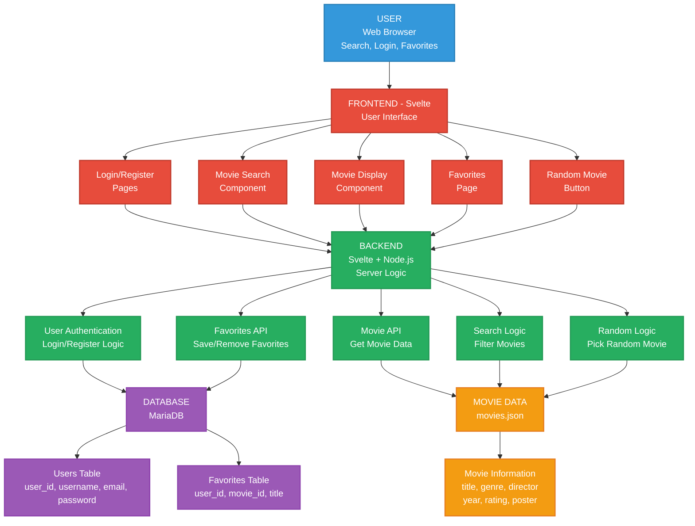

# IMDB - by kine !

I've made a IMDB copy-project, where you can find movies to watch ect !! This projeck is made using svelte as my frontend and bakcend, whilst i am using mairadb as my database. 

this website is made for people looking for more movies to watch, or just want somehtign random playing in the background. you can randomise a movie or search for anthing. as someone who has trouble or struggle to find something to watch, this website is perfect !! 

- [IMDB project](#IMDB-project)
  - [Prerequisits](#prerequisits)
  - [How to run??](#how-to-run-)
  - [Other](#other)

  
### Prerequisites
To run and use my application on your own you will need a few prerequisites.

To download and use different commands you'll need brew and node.js. **Brew** first:


```bash
# brew install
/bin/bash -c "$(curl -fsSL https://raw.githubusercontent.com/Homebrew/install/HEAD/install.sh)"
```

And so **node.js:**
```bash
# nvm install (to install node)
curl -o- https://raw.githubusercontent.com/nvm-sh/nvm/v0.40.3/install.sh | bash
```

```bash
# node install
nvm install 22
```

Now, you want to clone the repo over to your own: 

```bash
# clone repo
git clone https://github.com/mozartamadeus1756/IMDB-drift.git
cd imdb-drift

```

For us to connect to the database we will make in Azure, in the SQL Database resource, we have to add our env connections too:

```env
DB_SERVER='imdb-database-server.database.windows.net' 
DB_USER='database-user-or-admin-user'
DB_PASSWORD='database-password'
DB_NAME='database-name'
```

Now that thats all set, we also have to add a `.github` and `workflows` file under eachother:


This is where our registered users are placed, and the passwords are crypted and secured. 

For our database to be secured, but also make a connection we'll make a `.env` file in our root directory, where we store our database credentials. 

**(change the values to what matches your own credentials)**

```env
DB_HOST=localhost
DB_USER=your_username
DB_PASSWORD=your_password
DB_NAME=your_database_name
DB_CONNECTION_LIMIT=5
```

## How to run ?? 

So now that you've downloaded the prerequisites, its time to run our app. 

First, you want to install npm (node) dependencies: 

```bash
npm install 
```
Also, too make the passwords register crypted, we also need to install **bcrypt****:

```bash
# install bcrypt
npm install bcrypt
```

And start the development server:

```bash
npm run dev 
```

**BTW** this is how all my folders and files look like: 

```src
IMDB/
├── src/
│   ├── lib/
│   │   ├── db/
│   │   │   └── mariadb.js     
│   └── routes/
│       ├── +page.svelte                    # Homepage
│       ├── db/
│       │    ├── login/
│       │    │   └── +server.js             # Login API
│       │    ├── register/
│       │    │   └── +server.js             # Register API
│       │    └── favorites/
│       │         ├── add/+server.js        # Add favorite
│       │         ├── remove/+server.js     # Remove favorite
│       │         ├── check/+server.js      # Check favorite
│       │         └── get/+server.js        # Get favorites
│       ├── components/
│       │   ├── MovieCard.svelte            # Movie display component
│       │   ├── Navbar.svelte               # Navigation
│       │   └── NavbarFav.svelte            # Navigation with favorites
│       ├── favorites/
│       │   └── +page.svelte                # Favorites page
│       ├── login/
│       │   └── +page.svelte                # Login page
│       ├── register/
│       │   └── +page.svelte                # Register page
│       ├── main/
│       │   └── +page.svelte                # Main movies page
│       ├── search/
│       │   └── +page.svelte                # Search page
│       └── randomise/
│           └── +page.svelte                # Random movie page
├── static/
│   └── movies.json                         # Movie data
├── package.json                            # Dependencies
├── .env 
└── README.md                               # Documentation
```

## Other 

To show how my project is built i've made a system sketch: 



Later, for deployment i've made this risk anlalysis of my website, in case anything goes worng or i get attacked so and so ..


# sv

Everything you need to build a Svelte project, powered by [`sv`](https://github.com/sveltejs/cli).

## Creating a project

If you're seeing this, you've probably already done this step. Congrats!

```bash
# create a new project in the current directory
npx sv create

# create a new project in my-app
npx sv create my-app
```

## Developing

Once you've created a project and installed dependencies with `npm install` (or `pnpm install` or `yarn`), start a development server:

```bash
npm run dev

# or start the server and open the app in a new browser tab
npm run dev -- --open
```

## Building

To create a production version of your app:

```bash
npm run build
```

You can preview the production build with `npm run preview`.

> To deploy your app, you may need to install an [adapter](https://svelte.dev/docs/kit/adapters) for your target environment.
